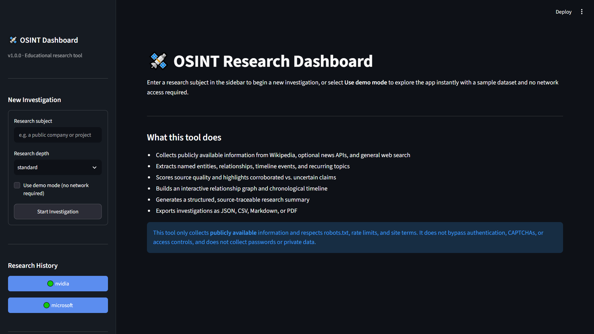
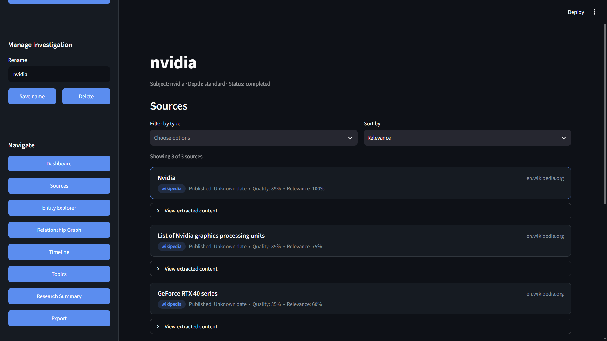
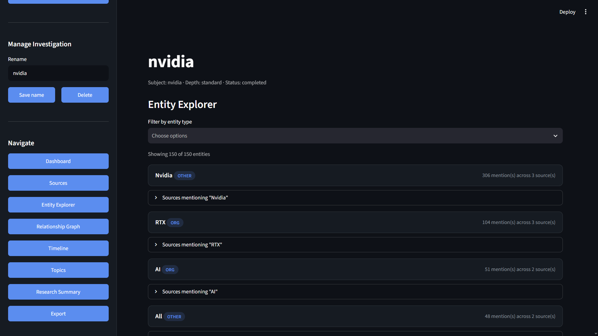
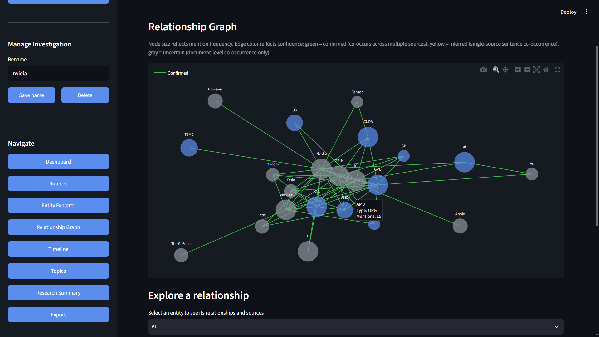
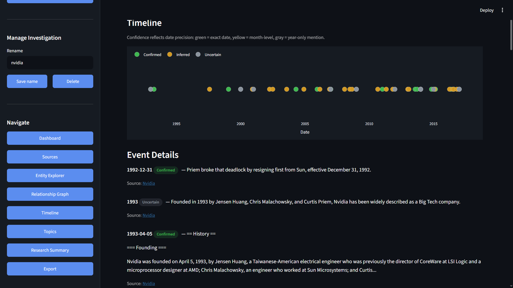
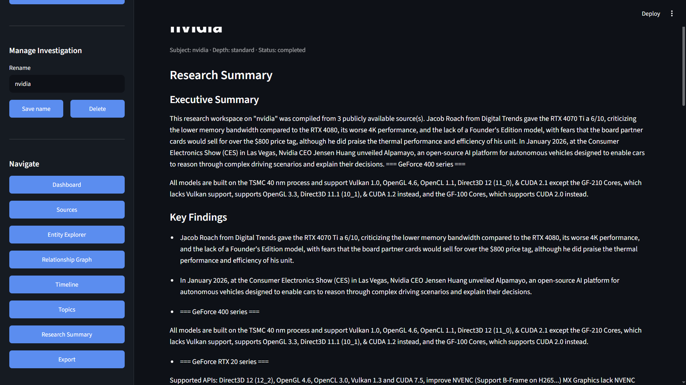
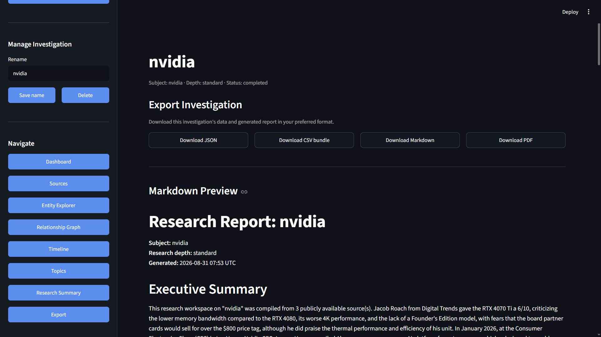

# OSINT Research Dashboard

A local research workspace for open-source intelligence gathering. You give it a subject — a company, a public project, an organization — and it pulls together everything it can find from public sources, then organizes it into entities, relationships, a timeline, and a written summary you can actually use.

I built this because most OSINT tooling is either a paid SaaS product or a pile of disconnected scripts. This is neither — it's a single Streamlit app that runs on your machine, keeps everything in a local SQLite file, and doesn't require a single paid API key to work.



## What it actually does

Type in a subject, hit start, and it will:

- Pull relevant Wikipedia pages, and (if you've set up a free NewsAPI key) recent news coverage
- Extract named entities — people, orgs, products, locations — and count how often each one shows up
- Map relationships between entities based on how often they're mentioned together, and rate each connection as confirmed, inferred, or uncertain depending on how much evidence backs it up
- Build a timeline out of dates it finds in the source text
- Pull out recurring topics/themes across everything it collected
- Score each source on a rough quality scale (source type, whether it has a date, how much corroboration it has)
- Write an executive summary with key findings, grounded in what it actually found — no fabricated claims
- Let you export the whole thing as JSON, CSV, Markdown, or PDF

Everything stays traceable back to its source. Every entity, every relationship, every timeline event links to the source it came from, so you're never taking the summary's word for it.

## Screenshots

**Dashboard** — source/entity counts, coverage score, quick charts


**Sources** — every collected page, filterable and sortable by relevance/quality


**Entity Explorer** — every extracted entity with mention counts and linked sources


**Relationship Graph** — interactive, color-coded by how confident the connection is


**Timeline** — chronological events pulled from source text, confidence-tagged


**Research Summary** — auto-generated executive summary and key findings


**Export** — JSON, CSV, Markdown, PDF, all one click away


## Why it's built this way

**Nothing is required to be paid.** Wikipedia collection works out of the box. News collection needs a free NewsAPI key, and if you don't have one, the app just skips that source and keeps going — it doesn't break or nag you.

**Nothing about this depends on a single point of failure.** If one page fails to load, or one source is blocked, or your spaCy model isn't installed, the app degrades gracefully instead of crashing. Entity extraction falls back to a regex-based extractor if spaCy isn't there. PDF export just doesn't show up as an option if `reportlab` isn't installed. You'll never see a stack trace because an optional piece is missing.

**Demo mode is real, not decorative.** Flip it on and you get a full sample investigation — sources, entities, a graph, a timeline, a report — no internet connection needed. Good for trying the app out, or for demoing it somewhere without wifi.

**Everything is honest about its own confidence.** Relationships are tagged confirmed/inferred/uncertain depending on how many sources back them up. Timeline events are tagged by date precision. The report explicitly separates what's source-backed from what's inferred. This isn't a tool that pretends to know more than it does.

## Tech stack

Streamlit for the UI, SQLite + SQLAlchemy for storage, BeautifulSoup for parsing, spaCy (optional) for entity recognition with a regex fallback, scikit-learn for topic extraction, NetworkX + Plotly for the relationship graph, Pydantic for validation. No frontend framework, no separate backend — it's one Python app.

## Getting started

```bash
git clone <your-repo-url>
cd osint-dashboard

python -m venv venv
source venv/bin/activate        # Windows: venv\Scripts\activate

pip install -r requirements.txt
streamlit run app.py
```

Windows users, see `QUICKSTART.md` for exact PowerShell commands.

Want better entity extraction? Grab the spaCy model:

```bash
python -m spacy download en_core_web_sm
```

Without it, entity extraction still works, just with a cruder fallback.

### Optional config

Copy `.env.example` to `.env` if you want a NewsAPI key for news collection. Everything else is optional and defaults to sensible values. The app runs fine with no `.env` file at all.

## Try it without any setup

Check "Use demo mode" in the sidebar and hit Start Investigation. You'll get a complete sample investigation instantly — no network access, no API keys, nothing to configure.

## Project layout

```
osint-dashboard/
├── app.py                  # Streamlit app
├── config/settings.py       # Central config
├── core/                    # DB models, schemas, pipeline orchestration, demo data
├── collectors/               # Wikipedia, news, general web collection
├── analysis/                  # Entity/relationship/timeline/topic extraction, scoring, summarization
├── visualization/              # Plotly charts and the relationship graph
├── reports/exporter.py          # JSON/CSV/Markdown/PDF export
├── ui/                           # Components and styling
└── tests/                         # pytest suite
```

## Known limitations

Being upfront about where this tool falls short:

- Entity extraction quality drops noticeably without the spaCy model installed — the fallback extractor is regex-based and will pick up some noise (common words tagged as generic entities).
- Timeline dates come from regex pattern matching over natural language text. It'll miss unusual date formats and occasionally attach a date to the wrong sentence.
- "Relationships" here means entities that show up near each other in the same sentence or document — not verified real-world relationships. Always check the linked source before treating a connection as fact.
- General web search depends on scraping DuckDuckGo's HTML results page, which could change its structure at any time and break that particular collector (Wikipedia and news collection are unaffected if it does).
- Source quality scores are a transparent heuristic (source type, date, length, corroboration) — not a claim about actual reliability.

## A note on ethics

This is meant for research using information that's already public. It respects robots.txt and rate limits by default, doesn't try to get around CAPTCHAs or logins, and doesn't collect passwords or private data. Treat everything it outputs as a research aid to verify, not a finished fact — that's exactly why every claim links back to where it came from.

## License

Add your preferred license here.
